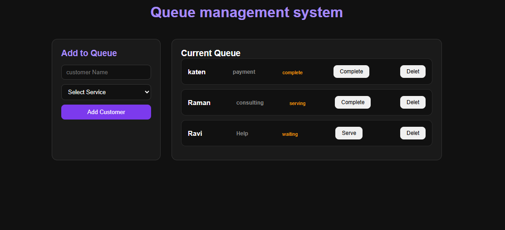

# 🎯 Queue Management System

A React-based queue management app to efficiently manage customers and their service status in real time.

  

## 🚀 Live Demo

[View Live →](https://queue-management-system-black.vercel.app/)

## 📸 Preview



---

## ✨ Features

- **Add customers** to the queue with name and service type
- **Track status** — waiting → serving → complete
- **Dynamic buttons** — button label changes based on current status
- **Delete customers** from the queue
- **Form resets** automatically after adding a customer
- Clean dark UI

---

## 🛠️ Built With

- React.js
- useState Hook
- Props & Lifting State Up
- Component-based architecture
- Custom CSS

---

## 📂 Project Structure

```
src/
├── App.jsx          # Main component — state & logic
├── App.css          # Global styles
└── Component/
    ├── Form.jsx     # Add customer form
    └── Queue.jsx    # Customer queue list
```

---

## 🧠 Concepts Practiced

- `useState` for state management
- Lifting state up (child → parent communication)
- Callback props (passing functions as props)
- Array methods — `map`, `filter`, spread operator
- Controlled inputs
- Conditional rendering

---

## ⚙️ Getting Started

```bash
# Clone the repo
git clone https://github.com/ravimali-dev/Queue-Management-System.git

# Navigate to project
cd Queue-Management-System

# Install dependencies
npm install

# Start development server
npm run dev
```

---

## 👨‍💻 Author

**Ravi Mali**
- Portfolio: [ravimali.vercel.app](https://ravimali.vercel.app)
- GitHub: [@ravimali-dev](https://github.com/ravimali-dev)
- LinkedIn: [linkedin.com/in/ravi-mali-dev](https://linkedin.com/in/ravi-mali-dev)
